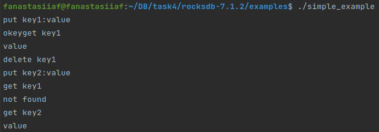

# rocksdb

## Домашняя работа №4.
**Цель:** Научиться разбираться в любой СУБД зная только ее название. 
**Описание/ инструкция выполнения домашнего задания:**
Вам необходимо сделать отчет и ответить на следующие вопросы. Ответы должны быть развернуты и желательно с рисунками или примерами кода.
1. [История развития СУБД](https://github.com/FAnastasiaF/rocksdb/blob/main/README.md#%D0%B8%D1%81%D1%82%D0%BE%D1%80%D0%B8%D1%8F-%D1%80%D0%B0%D0%B7%D0%B2%D0%B8%D1%82%D0%B8%D1%8F-%D1%81%D1%83%D0%B1%D0%B4)
2. [Инструменты для взаимодействия с СУБД](https://github.com/FAnastasiaF/rocksdb/blob/main/README.md#%D0%B8%D0%BD%D1%81%D1%82%D1%80%D1%83%D0%BC%D0%B5%D0%BD%D1%82%D1%8B-%D0%B4%D0%BB%D1%8F-%D0%B2%D0%B7%D0%B0%D0%B8%D0%BC%D0%BE%D0%B4%D0%B5%D0%B9%D1%81%D1%82%D0%B2%D0%B8%D1%8F-%D1%81-%D1%81%D1%83%D0%B1%D0%B4)
3. [Какой database engine используется в вашей СУБД?](https://github.com/FAnastasiaF/rocksdb/blob/main/README.md#%D0%BA%D0%B0%D0%BA%D0%BE%D0%B9-database-engine-%D0%B8%D1%81%D0%BF%D0%BE%D0%BB%D1%8C%D0%B7%D1%83%D0%B5%D1%82%D1%81%D1%8F-%D0%B2-%D0%B2%D0%B0%D1%88%D0%B5%D0%B9-%D1%81%D1%83%D0%B1%D0%B4)
4. [Как устроен язык запросов в вашей СУБД? Разверните БД с данными и выполните ряд запросов.](https://github.com/FAnastasiaF/rocksdb/blob/main/README.md#%D0%BA%D0%B0%D0%BA-%D1%83%D1%81%D1%82%D1%80%D0%BE%D0%B5%D0%BD-%D1%8F%D0%B7%D1%8B%D0%BA-%D0%B7%D0%B0%D0%BF%D1%80%D0%BE%D1%81%D0%BE%D0%B2-%D0%B2-%D0%B2%D0%B0%D1%88%D0%B5%D0%B9-%D1%81%D1%83%D0%B1%D0%B4-%D1%80%D0%B0%D0%B7%D0%B2%D0%B5%D1%80%D0%BD%D0%B8%D1%82%D0%B5-%D0%B1%D0%B4-%D1%81-%D0%B4%D0%B0%D0%BD%D0%BD%D1%8B%D0%BC%D0%B8-%D0%B8-%D0%B2%D1%8B%D0%BF%D0%BE%D0%BB%D0%BD%D0%B8%D1%82%D0%B5-%D1%80%D1%8F%D0%B4-%D0%B7%D0%B0%D0%BF%D1%80%D0%BE%D1%81%D0%BE%D0%B2) 
5. [Распределение файлов БД по разным носителям?](https://github.com/FAnastasiaF/rocksdb/blob/main/README.md#%D1%80%D0%B0%D1%81%D0%BF%D1%80%D0%B5%D0%B4%D0%B5%D0%BB%D0%B5%D0%BD%D0%B8%D0%B5-%D1%84%D0%B0%D0%B9%D0%BB%D0%BE%D0%B2-%D0%B1%D0%B4-%D0%BF%D0%BE-%D1%80%D0%B0%D0%B7%D0%BD%D1%8B%D0%BC-%D0%BD%D0%BE%D1%81%D0%B8%D1%82%D0%B5%D0%BB%D1%8F%D0%BC)
6. [На каком языке/ах программирования написана СУБД?](https://github.com/FAnastasiaF/rocksdb/blob/main/README.md#%D0%BD%D0%B0-%D0%BA%D0%B0%D0%BA%D0%BE%D0%BC-%D1%8F%D0%B7%D1%8B%D0%BA%D0%B5%D0%B0%D1%85-%D0%BF%D1%80%D0%BE%D0%B3%D1%80%D0%B0%D0%BC%D0%BC%D0%B8%D1%80%D0%BE%D0%B2%D0%B0%D0%BD%D0%B8%D1%8F-%D0%BD%D0%B0%D0%BF%D0%B8%D1%81%D0%B0%D0%BD%D0%B0-%D1%81%D1%83%D0%B1%D0%B4)
7. [Какие типы индексов поддерживаются в БД? Приведите пример создания индексов.](https://github.com/FAnastasiaF/rocksdb/blob/main/README.md#%D0%BA%D0%B0%D0%BA%D0%B8%D0%B5-%D1%82%D0%B8%D0%BF%D1%8B-%D0%B8%D0%BD%D0%B4%D0%B5%D0%BA%D1%81%D0%BE%D0%B2-%D0%BF%D0%BE%D0%B4%D0%B4%D0%B5%D1%80%D0%B6%D0%B8%D0%B2%D0%B0%D1%8E%D1%82%D1%81%D1%8F-%D0%B2-%D0%B1%D0%B4-%D0%BF%D1%80%D0%B8%D0%B2%D0%B5%D0%B4%D0%B8%D1%82%D0%B5-%D0%BF%D1%80%D0%B8%D0%BC%D0%B5%D1%80-%D1%81%D0%BE%D0%B7%D0%B4%D0%B0%D0%BD%D0%B8%D1%8F-%D0%B8%D0%BD%D0%B4%D0%B5%D0%BA%D1%81%D0%BE%D0%B2)
8. [Как строится процесс выполнения запросов в вашей СУБД?](https://github.com/FAnastasiaF/rocksdb/blob/main/README.md#%D0%BA%D0%B0%D0%BA-%D1%81%D1%82%D1%80%D0%BE%D0%B8%D1%82%D1%81%D1%8F-%D0%BF%D1%80%D0%BE%D1%86%D0%B5%D1%81%D1%81-%D0%B2%D1%8B%D0%BF%D0%BE%D0%BB%D0%BD%D0%B5%D0%BD%D0%B8%D1%8F-%D0%B7%D0%B0%D0%BF%D1%80%D0%BE%D1%81%D0%BE%D0%B2-%D0%B2-%D0%B2%D0%B0%D1%88%D0%B5%D0%B9-%D1%81%D1%83%D0%B1%D0%B4)
9. [Есть ли для вашей СУБД понятие «план запросов»? Если да, объясните, как работает данный этап.](https://github.com/FAnastasiaF/rocksdb/blob/main/README.md#%D0%B5%D1%81%D1%82%D1%8C-%D0%BB%D0%B8-%D0%B4%D0%BB%D1%8F-%D0%B2%D0%B0%D1%88%D0%B5%D0%B9-%D1%81%D1%83%D0%B1%D0%B4-%D0%BF%D0%BE%D0%BD%D1%8F%D1%82%D0%B8%D0%B5-%D0%BF%D0%BB%D0%B0%D0%BD-%D0%B7%D0%B0%D0%BF%D1%80%D0%BE%D1%81%D0%BE%D0%B2-%D0%B5%D1%81%D0%BB%D0%B8-%D0%B4%D0%B0-%D0%BE%D0%B1%D1%8A%D1%8F%D1%81%D0%BD%D0%B8%D1%82%D0%B5-%D0%BA%D0%B0%D0%BA-%D1%80%D0%B0%D0%B1%D0%BE%D1%82%D0%B0%D0%B5%D1%82-%D0%B4%D0%B0%D0%BD%D0%BD%D1%8B%D0%B9-%D1%8D%D1%82%D0%B0%D0%BF)
10. [Поддерживаются ли транзакции в вашей СУБД? Если да, то расскажите о нем. Если нет, то существует ли альтернатива?](https://github.com/FAnastasiaF/rocksdb/blob/main/README.md#%D0%BF%D0%BE%D0%B4%D0%B4%D0%B5%D1%80%D0%B6%D0%B8%D0%B2%D0%B0%D1%8E%D1%82%D1%81%D1%8F-%D0%BB%D0%B8-%D1%82%D1%80%D0%B0%D0%BD%D0%B7%D0%B0%D0%BA%D1%86%D0%B8%D0%B8-%D0%B2-%D0%B2%D0%B0%D1%88%D0%B5%D0%B9-%D1%81%D1%83%D0%B1%D0%B4-%D0%B5%D1%81%D0%BB%D0%B8-%D0%B4%D0%B0-%D1%82%D0%BE-%D1%80%D0%B0%D1%81%D1%81%D0%BA%D0%B0%D0%B6%D0%B8%D1%82%D0%B5-%D0%BE-%D0%BD%D0%B5%D0%BC-%D0%B5%D1%81%D0%BB%D0%B8-%D0%BD%D0%B5%D1%82-%D1%82%D0%BE-%D1%81%D1%83%D1%89%D0%B5%D1%81%D1%82%D0%B2%D1%83%D0%B5%D1%82-%D0%BB%D0%B8-%D0%B0%D0%BB%D1%8C%D1%82%D0%B5%D1%80%D0%BD%D0%B0%D1%82%D0%B8%D0%B2%D0%B0)
11. [Какие методы восстановления поддерживаются в вашей СУБД. Расскажите о них.](https://github.com/FAnastasiaF/rocksdb/blob/main/README.md#%D0%BA%D0%B0%D0%BA%D0%B8%D0%B5-%D0%BC%D0%B5%D1%82%D0%BE%D0%B4%D1%8B-%D0%B2%D0%BE%D1%81%D1%81%D1%82%D0%B0%D0%BD%D0%BE%D0%B2%D0%BB%D0%B5%D0%BD%D0%B8%D1%8F-%D0%BF%D0%BE%D0%B4%D0%B4%D0%B5%D1%80%D0%B6%D0%B8%D0%B2%D0%B0%D1%8E%D1%82%D1%81%D1%8F-%D0%B2-%D0%B2%D0%B0%D1%88%D0%B5%D0%B9-%D1%81%D1%83%D0%B1%D0%B4-%D1%80%D0%B0%D1%81%D1%81%D0%BA%D0%B0%D0%B6%D0%B8%D1%82%D0%B5-%D0%BE-%D0%BD%D0%B8%D1%85)
12. [Расскажите про шардинг в вашей конкретной СУБД. Какие типы используются? Принцип работы.](https://github.com/FAnastasiaF/rocksdb/blob/main/README.md#%D1%80%D0%B0%D1%81%D1%81%D0%BA%D0%B0%D0%B6%D0%B8%D1%82%D0%B5-%D0%BF%D1%80%D0%BE-%D1%88%D0%B0%D1%80%D0%B4%D0%B8%D0%BD%D0%B3-%D0%B2-%D0%B2%D0%B0%D1%88%D0%B5%D0%B9-%D0%BA%D0%BE%D0%BD%D0%BA%D1%80%D0%B5%D1%82%D0%BD%D0%BE%D0%B9-%D1%81%D1%83%D0%B1%D0%B4-%D0%BA%D0%B0%D0%BA%D0%B8%D0%B5-%D1%82%D0%B8%D0%BF%D1%8B-%D0%B8%D1%81%D0%BF%D0%BE%D0%BB%D1%8C%D0%B7%D1%83%D1%8E%D1%82%D1%81%D1%8F-%D0%BF%D1%80%D0%B8%D0%BD%D1%86%D0%B8%D0%BF-%D1%80%D0%B0%D0%B1%D0%BE%D1%82%D1%8B)
13. [Возможно ли применить термины Data Mining, Data Warehousing и OLAP в вашей СУБД?](https://github.com/FAnastasiaF/rocksdb/blob/main/README.md#%D0%B2%D0%BE%D0%B7%D0%BC%D0%BE%D0%B6%D0%BD%D0%BE-%D0%BB%D0%B8-%D0%BF%D1%80%D0%B8%D0%BC%D0%B5%D0%BD%D0%B8%D1%82%D1%8C-%D1%82%D0%B5%D1%80%D0%BC%D0%B8%D0%BD%D1%8B-data-mining-data-warehousing-%D0%B8-olap-%D0%B2-%D0%B2%D0%B0%D1%88%D0%B5%D0%B9-%D1%81%D1%83%D0%B1%D0%B4)
14. [Какие методы защиты поддерживаются вашей СУБД? Шифрование трафика, модели авторизации и т.п.](https://github.com/FAnastasiaF/rocksdb/blob/main/README.md#%D0%BA%D0%B0%D0%BA%D0%B8%D0%B5-%D0%BC%D0%B5%D1%82%D0%BE%D0%B4%D1%8B-%D0%B7%D0%B0%D1%89%D0%B8%D1%82%D1%8B-%D0%BF%D0%BE%D0%B4%D0%B4%D0%B5%D1%80%D0%B6%D0%B8%D0%B2%D0%B0%D1%8E%D1%82%D1%81%D1%8F-%D0%B2%D0%B0%D1%88%D0%B5%D0%B9-%D1%81%D1%83%D0%B1%D0%B4-%D1%88%D0%B8%D1%84%D1%80%D0%BE%D0%B2%D0%B0%D0%BD%D0%B8%D0%B5-%D1%82%D1%80%D0%B0%D1%84%D0%B8%D0%BA%D0%B0-%D0%BC%D0%BE%D0%B4%D0%B5%D0%BB%D0%B8-%D0%B0%D0%B2%D1%82%D0%BE%D1%80%D0%B8%D0%B7%D0%B0%D1%86%D0%B8%D0%B8-%D0%B8-%D1%82%D0%BF)
15. [Какие сообщества развивают данную СУБД? Кто в проекте имеет права на коммит и создание дистрибутива версий? Расскажите об этих людей и/или компаниях.](https://github.com/FAnastasiaF/rocksdb/blob/main/README.md#%D0%BA%D0%B0%D0%BA%D0%B8%D0%B5-%D1%81%D0%BE%D0%BE%D0%B1%D1%89%D0%B5%D1%81%D1%82%D0%B2%D0%B0-%D1%80%D0%B0%D0%B7%D0%B2%D0%B8%D0%B2%D0%B0%D1%8E%D1%82-%D0%B4%D0%B0%D0%BD%D0%BD%D1%83%D1%8E-%D1%81%D1%83%D0%B1%D0%B4-%D0%BA%D1%82%D0%BE-%D0%B2-%D0%BF%D1%80%D0%BE%D0%B5%D0%BA%D1%82%D0%B5-%D0%B8%D0%BC%D0%B5%D0%B5%D1%82-%D0%BF%D1%80%D0%B0%D0%B2%D0%B0-%D0%BD%D0%B0-%D0%BA%D0%BE%D0%BC%D0%BC%D0%B8%D1%82-%D0%B8-%D1%81%D0%BE%D0%B7%D0%B4%D0%B0%D0%BD%D0%B8%D0%B5-%D0%B4%D0%B8%D1%81%D1%82%D1%80%D0%B8%D0%B1%D1%83%D1%82%D0%B8%D0%B2%D0%B0-%D0%B2%D0%B5%D1%80%D1%81%D0%B8%D0%B9-%D1%80%D0%B0%D1%81%D1%81%D0%BA%D0%B0%D0%B6%D0%B8%D1%82%D0%B5-%D0%BE%D0%B1-%D1%8D%D1%82%D0%B8%D1%85-%D0%BB%D1%8E%D0%B4%D1%8F%D1%85-%D0%B8%D0%B8%D0%BB%D0%B8-%D0%BA%D0%BE%D0%BC%D0%BF%D0%B0%D0%BD%D0%B8%D1%8F%D1%85)
16. [Создайте свои собственные данные для демонстрации работы СУБД.](https://github.com/FAnastasiaF/rocksdb/blob/main/README.md#%D1%81%D0%BE%D0%B7%D0%B4%D0%B0%D0%B9%D1%82%D0%B5-%D1%81%D0%B2%D0%BE%D0%B8-%D1%81%D0%BE%D0%B1%D1%81%D1%82%D0%B2%D0%B5%D0%BD%D0%BD%D1%8B%D0%B5-%D0%B4%D0%B0%D0%BD%D0%BD%D1%8B%D0%B5-%D0%B4%D0%BB%D1%8F-%D0%B4%D0%B5%D0%BC%D0%BE%D0%BD%D1%81%D1%82%D1%80%D0%B0%D1%86%D0%B8%D0%B8-%D1%80%D0%B0%D0%B1%D0%BE%D1%82%D1%8B-%D1%81%D1%83%D0%B1%D0%B4) 
17. [Как продолжить самостоятельное изучение языка запросов с помощью демобазы. Если демобазы нет, то создайте ее.](https://github.com/FAnastasiaF/rocksdb/blob/main/README.md#%D0%BA%D0%B0%D0%BA-%D0%BF%D1%80%D0%BE%D0%B4%D0%BE%D0%BB%D0%B6%D0%B8%D1%82%D1%8C-%D1%81%D0%B0%D0%BC%D0%BE%D1%81%D1%82%D0%BE%D1%8F%D1%82%D0%B5%D0%BB%D1%8C%D0%BD%D0%BE%D0%B5-%D0%B8%D0%B7%D1%83%D1%87%D0%B5%D0%BD%D0%B8%D0%B5-%D1%8F%D0%B7%D1%8B%D0%BA%D0%B0-%D0%B7%D0%B0%D0%BF%D1%80%D0%BE%D1%81%D0%BE%D0%B2-%D1%81-%D0%BF%D0%BE%D0%BC%D0%BE%D1%89%D1%8C%D1%8E-%D0%B4%D0%B5%D0%BC%D0%BE%D0%B1%D0%B0%D0%B7%D1%8B-%D0%B5%D1%81%D0%BB%D0%B8-%D0%B4%D0%B5%D0%BC%D0%BE%D0%B1%D0%B0%D0%B7%D1%8B-%D0%BD%D0%B5%D1%82-%D1%82%D0%BE-%D1%81%D0%BE%D0%B7%D0%B4%D0%B0%D0%B9%D1%82%D0%B5-%D0%B5%D0%B5)
18. [Где найти документацию и пройти обучение](https://github.com/FAnastasiaF/rocksdb/blob/main/README.md#%D0%B3%D0%B4%D0%B5-%D0%BD%D0%B0%D0%B9%D1%82%D0%B8-%D0%B4%D0%BE%D0%BA%D1%83%D0%BC%D0%B5%D0%BD%D1%82%D0%B0%D1%86%D0%B8%D1%8E-%D0%B8-%D0%BF%D1%80%D0%BE%D0%B9%D1%82%D0%B8-%D0%BE%D0%B1%D1%83%D1%87%D0%B5%D0%BD%D0%B8%D0%B5)
19. [Как быть в курсе происходящего](https://github.com/FAnastasiaF/rocksdb/blob/main/README.md#%D0%BA%D0%B0%D0%BA-%D0%B1%D1%8B%D1%82%D1%8C-%D0%B2-%D0%BA%D1%83%D1%80%D1%81%D0%B5-%D0%BF%D1%80%D0%BE%D0%B8%D1%81%D1%85%D0%BE%D0%B4%D1%8F%D1%89%D0%B5%D0%B3%D0%BE)

### История развития СУБД
RocksDB — это высокопроизводительный, постоянный механизм хранения ключей и значений, созданный Facebook* в 2012 году на основе кодовой базы LevelDB от Google.
В попытке расширить успех HDFS от анализа данных до рабочих нагрузок обслуживания запросов (эта рабочая нагрузка требует малой задержки), Дхруба Бортакур улучшил HBase и сделал его задержки в два раза медленнее, чем у сервера MySQL. Затем, когда появилось флэш-хранилище, стало ясно, что для эффективного обслуживания произвольной рабочей нагрузки необходим новый механизм хранения.

Он начал искать новые методы для создания хранилища ключей и значений следующего поколения, особенно для обслуживания данных, находящихся в быстром хранилище. Поскольку он использовал флэш-память, доступ к сетевым данным был на 50 % выше, чем доступ к локальным данным, а это означало, что встроенная база данных в приложении могла иметь гораздо меньшую задержку, чем приложения, которые обращаются к данным по сети.

В то время существовало несколько встраиваемых баз данных: BerkeleyDB, SQLite3, а также leveldb, который был самым быстрым по результатам бенчмарков с открытым исходным кодом, плюс он был написан на C++, поэтому leveldb стал первым выбором для его бенчмаркинга.

Вскоре он обнаружил, что leveldb не подходит для рабочих нагрузок Query Serving. leveldb хорошо работает только тогда, когда размер базы данных меньше размера оперативной памяти. Кроме того, однопоточного процесса сжатия leveldb было недостаточно для управления рабочими нагрузками сервера, и он не мог использовать все операции ввода-вывода, предлагаемые базовым флэш-хранилищем.

В конце концов, он решил, что лучший путь — разветвить код leveldb и изменить его архитектуру в соответствии с потребностями (использовать базу данных, которая может работать с быстрым оборудованием хранения), и тогда родилась RocksDB.
### Инструменты для взаимодействия с СУБД
[API java](https://github.com/facebook/rocksdb/tree/main/java/src/main/java/org/rocksdb)  
[API c++](https://github.com/facebook/rocksdb/tree/main/include/rocksdb)  
### Какой database engine используется в вашей СУБД?  
RocksDB - использует log-structured storage engine.  
**Log-structured storage engine(LSM-деревья):**  
log-structured storage engine индексирует данные в 2 структуры данных:
1. Сбалансированная древовидная структура(memtable)
2. Набор сегментов хранения(Sorted String Table)  
Каждый сегмент представляет собой отсортированную коллекцию пар ключ-значение.

  
ччВот несколько свойств SSTables:
1. Ключи сортируются в определенном сегменте.
2. Конкретный ключ может появиться только один раз в конкретном сегменте.
3. Ключ может повторяться в нескольких сегментах, но должен быть уникальным в конкретном сегменте.
4. Размер SSTables зависит от количества содержащихся в нем ключей, поэтому разные SSTables могут иметь разные размеры.
**Как обрабатываются записи?**
После поступления записи:
1. Запись добавляется в memtable
2. Каждый раз, когда размер memtable превышает какое-то значение, он сбрасывается на диск в отсортированном ввиде в SSTable
**Как обрабатываются чтения?**
1. Сначала memtable сканируется на наличие ключа. Если найдено, возвращается значение.
2. Иначе, ключ ищется в последнем сегменте, если там нет, то в предпоследней и т.д.  
### Как устроен язык запросов в вашей СУБД? Разверните БД с данными и выполните ряд запросов. 
Операция | Описание
:--- | :------------
Get key:value | получить одно значение по ключу
Put key | установить одно значение по ключу
Delete key | удалить ключ из БД
... |


```
#include <cstdio>
#include <string>
#include <iostream>

#include "rocksdb/db.h"
#include "rocksdb/slice.h"
#include "rocksdb/options.h"

using ROCKSDB_NAMESPACE::DB;
using ROCKSDB_NAMESPACE::Options;
using ROCKSDB_NAMESPACE::PinnableSlice;
using ROCKSDB_NAMESPACE::ReadOptions;
using ROCKSDB_NAMESPACE::Status;
using ROCKSDB_NAMESPACE::WriteBatch;
using ROCKSDB_NAMESPACE::WriteOptions;

#if defined(OS_WIN)
std::string kDBPath = "C:\\Windows\\TEMP\\rocksdb_simple_example";
#else
std::string kDBPath = "/tmp/rocksdb_simple_example";
#endif

int main() {
  DB* db;
  Options options;
  // Optimize RocksDB. This is the easiest way to get RocksDB to perform well
  options.IncreaseParallelism();
  options.OptimizeLevelStyleCompaction();
  // create the DB if it's not already present
  options.create_if_missing = true;

  // open DB
  Status s = DB::Open(options, kDBPath, &db);
  assert(s.ok());

  // Put key-value
  std::cout << "put key1:value\n";
  s = db->Put(WriteOptions(), "key1", "value");
  std::cout << "okey";
  assert(s.ok());
  std::string value;
  // get value
  std::cout << "get key1\n";
  s = db->Get(ReadOptions(), "key1", &value);
    std::cout << value <<"\n";
  assert(s.ok());
  assert(value == "value");

  // atomically apply a set of updates
  {
    WriteBatch batch;
    batch.Delete("key1");
    std::cout << "delete key1\n";
    batch.Put("key2", value);
    std::cout << "put key2:value\n";
    s = db->Write(WriteOptions(), &batch);
  }

  std::cout << "get key1\n";
  s = db->Get(ReadOptions(), "key1", &value);
  assert(s.IsNotFound());
  std::cout << "not found\n";


  std::cout << "get key2\n";
  db->Get(ReadOptions(), "key2", &value);
  assert(value == "value");
  std::cout << value << "\n";

  delete db;

  return 0;
}
```



### Распределение файлов БД по разным носителям?
RocksDB не распределённая СУБД, поэтому файлы хранятся на одном носителе.
### На каком языке/ах программирования написана СУБД?
Изначально RocksDB — это библиотека C++.
### Какие типы индексов поддерживаются в БД? Приведите пример создания индексов.
В 2018 году на официальном [сайте](https://rocksdb.org/blog/2018/08/23/data-block-hash-index.html#:~:text=We've%20designed%20and%20implemented,data%20block%20for%20efficient%20indexing) rocsdb опубликовали пост, говорящий о том, что разработчики внедрили хэш-индекс блоков данных в RocksDB. В частности, они добавили компактную хеш-таблицу в конец блока данных для эффективной индексации. Он обратно совместим с базой данных, созданной без этой функции. После включения функции хеш-индекса существующие данные постепенно конвертируются в формат хэш-индекса.  
**Пример от разработчиков, как это использовать:**
Хэш-индекс по умолчанию отключен, если только <code>BlockBasedTableOptions::data_block_index_type</code> не установлено значение <code>data_block_index_type = kDataBlockBinaryAndHash</code>. Коэффициент использования хеш-таблицы регулируется с помощью <code>BlockBasedTableOptions::data_block_hash_table_util_ratio</code>, что допустимо только в том случае, если <code>data_block_index_type = kDataBlockBinaryAndHash</code>.
```
// the definitions can be found in include/rocksdb/table.h

// The index type that will be used for the data block.
enum DataBlockIndexType : char {
  kDataBlockBinarySearch = 0,  // traditional block type
  kDataBlockBinaryAndHash = 1, // additional hash index
};

// Set to kDataBlockBinaryAndHash to enable hash index
DataBlockIndexType data_block_index_type = kDataBlockBinarySearch;

// #entries/#buckets. It is valid only when data_block_hash_index_type is
// kDataBlockBinaryAndHash.
double data_block_hash_table_util_ratio = 0.75;
```
Чтобы найти правильное место, где может находиться ключ, с помощью бинарного поиска, требуется множественный анализ и сравнение ключей. Каждое ветвление бинарного поиска приводит к промаху кеша ЦП, вызывая большую загрузку ЦП.
  
Разработчики реализовали хэш-карту в конце блока для индексации ключа, чтобы уменьшить нагрузку на ЦП при двоичном поиске. Хэш-индекс — это просто массив указателей, указывающих на индекс двоичного поиска.  
  
### Как строится процесс выполнения запросов в вашей СУБД?
Запросы выполняются последовательно, остальные ситуации рассмотрены [тут](https://github.com/FAnastasiaF/rocksdb/edit/main/README.md#%D0%BF%D0%BE%D0%B4%D0%B4%D0%B5%D1%80%D0%B6%D0%B8%D0%B2%D0%B0%D1%8E%D1%82%D1%81%D1%8F-%D0%BB%D0%B8-%D1%82%D1%80%D0%B0%D0%BD%D0%B7%D0%B0%D0%BA%D1%86%D0%B8%D0%B8-%D0%B2-%D0%B2%D0%B0%D1%88%D0%B5%D0%B9-%D1%81%D1%83%D0%B1%D0%B4-%D0%B5%D1%81%D0%BB%D0%B8-%D0%B4%D0%B0-%D1%82%D0%BE-%D1%80%D0%B0%D1%81%D1%81%D0%BA%D0%B0%D0%B6%D0%B8%D1%82%D0%B5-%D0%BE-%D0%BD%D0%B5%D0%BC-%D0%B5%D1%81%D0%BB%D0%B8-%D0%BD%D0%B5%D1%82-%D1%82%D0%BE-%D1%81%D1%83%D1%89%D0%B5%D1%81%D1%82%D0%B2%D1%83%D0%B5%D1%82-%D0%BB%D0%B8-%D0%B0%D0%BB%D1%8C%D1%82%D0%B5%D1%80%D0%BD%D0%B0%D1%82%D0%B8%D0%B2%D0%B0)
### Есть ли для вашей СУБД понятие «план запросов»? Если да, объясните, как работает данный этап.
Нет
### Поддерживаются ли транзакции в вашей СУБД? Если да, то расскажите о нем. Если нет, то существует ли альтернатива?
RocksDB поддерживает транзакции при использовании <code>TransactionDB</code> или <code>OptimisticTransactionDB</code>(pessimistic и optimistic concurrency control).  
**_Optimistic concurrency control(OCC)_** - это метод управления параллелизмом, применяемый к транзакционным системам. OCC предполагает, что несколько транзакций часто могут выполняться, не мешая друг другу. Во время выполнения транзакции используют ресурсы данных, не блокируя эти ресурсы. Перед фиксацией каждая транзакция проверяет, что никакая другая транзакция не изменила прочитанные ею данные. Если проверка выявляет конфликтующие модификации, фиксирующая транзакция откатывается и может быть перезапущена.  
**_Pessimistic concurrency control(PCC)_** - это метод управления параллелизмом, применяемый к транзакционным системам. PCC предполагает худшее — что два или более пользователей захотят обновить одну и ту же запись одновременно, а затем предотвращает эту возможность, блокируя запись, нет. независимо от того, насколько маловероятны конфликты на самом деле. Блокировки устанавливаются, как только осуществляется доступ к любой части строки, что делает невозможным одновременное обновление строки двумя или более пользователями. В зависимости от режима блокировки ( совместно используемого , монопольного или обновляемого ) другие пользователи могут читать данные, даже если на них установлена блокировка.  
**TransactionDB**
При использовании <code>TransactionDB</code> все записанные ключи блокируются внутри RocksDB для обнаружения конфликтов. Если ключ не может быть заблокирован, операция вернет ошибку. Когда транзакция зафиксирована, она гарантированно будет успешной до тех пор, пока в базу данных можно будет производить запись. <code>TransactionDB</code> может быть лучше для рабочих нагрузок с большим параллелизмом по сравнению с <code>OptimisticTransactionDB</code>. Однако при использовании <code>TransactionDB</code> возникают небольшие затраты на блокировку.А также <code>TransactionDB</code> выполняет проверку конфликтов для всех операций записи (<code>Put</code>, <code>Delete</code></code> и <code>Merge</code>), включая записи, выполняемые вне транзакции.  
**OptimisticTransactionDB**
Оптимистичные транзакции обеспечивают упрощенное управление оптимистичным параллелизмом для рабочих нагрузок, которые не предполагают высокой конкуренции/интерференций между несколькими транзакциями.Оптимистичные транзакции не блокируются при подготовке к записи. Вместо этого они полагаются на обнаружение конфликтов во время фиксации, чтобы убедиться, что никакие другие писатели не изменили ключи, записываемые текущей транзакцией. Если есть конфликт с другой записью (или он не может быть определен), коммит вернет ошибку и никакие ключи не будут записаны.Оптимистичный контроль параллелизма полезен для многих рабочих нагрузок, которым требуется защита от случайных конфликтов записи. Однако это может быть не лучшим решением для рабочих нагрузок, где часто возникают конфликты записи из-за того, что множество транзакций постоянно пытаются обновить одни и те же ключи. Для этих рабочих нагрузо лучше подходит использование <code>TransactionDB</code>. <code>OptimisticTransactionDB</code> может быть более производительным, чем  <code>TransactionDB</code> для рабочих нагрузок с большим количеством нетранзакционных операций записи и небольшим количеством транзакций.
**Чтение из транзакции**  
Транзакции также поддерживают легкое чтение состояния ключей, которые в данный момент объединены в данную транзакцию, но еще не зафиксированы.  
**Защита от конфликтов чтения-записи**  
Если эта транзакция была создана с помощью <code>TransactionDB</code>, то либо тайм-аут, либо блокировка до тех пор, пока транзакция не будет зафиксирована или прервана. Если бы эта транзакция была создана с помощью <code>OptimisticTransactionDB</code>, то транзакция завершилась бы успешно, но при Commit вызове транзакция завершилась бы ошибкой.  
**Setting a Snapshot**  
По умолчанию проверка конфликтов транзакций подтверждает, что никто другой не записал ключ после того, как ключ был впервые записан в этой транзакции. Этой гарантии изоляции достаточно для многих случаев использования.

### Какие методы восстановления поддерживаются в вашей СУБД. Расскажите о них.

Данные большинства приложений RocksDB реплицируются на нескольких хостах, и часто они выполняют проверки согласованности, сравнивая контрольные суммы реплик. При обнаружении несоответствия контрольной суммы поврежденная реплика отбрасывается и заменяется правильной. Однако это жизнеспособный вариант только до тех пор, пока правильная реплика все еще существует и доступна. Сегодня RocksDB выполняет контрольные суммы файловых данных на нескольких уровнях, чтобы выявить повреждения, которые могли произойти в нижележащих слоях.

Блочные контрольные суммы, унаследованные от LevelDB, предотвращают раскрытие клиенту данных, поврежденных в файловой системе или ниже. В частности, к каждому блоку SSTable или фрагменту WAL прикреплена контрольная сумма, генерируемая при создании данных. В отличие от контрольной суммы файла, которая проверяется только при перемещении файла, эта контрольная сумма проверяется каждый раз при чтении блока либо для обслуживания запроса от приложения, либо для сжатия из-за меньшего объема.

Контрольные суммы файлов SSTable, добавленные в 2020 году, защищают от повреждения, вызванного базовой системой хранения, от распространения на другие реплики, а также от повреждения, вызванного в процессе передачи файлов SSTable по сети. Таким образом, каждая SSTable защищена собственной контрольной суммой, генерируемой при создании таблицы. Контрольная сумма SSTable записывается в записи файла метаданных SSTable и проверяется с помощью файла SSTable, куда бы он ни передавался. 
### Расскажите про шардинг в вашей конкретной СУБД. Какие типы используются? Принцип работы.
Изначально все данные типа «ключ-значение» хранились в одном семействе столбцов RocksDB: «по умолчанию». Но начиная с одной из версий(bluestore) начали использовать несколько типов данных «ключ-значение», хранящихся в RocksDB. Каждому типу данных назначается уникальный префикс. Благодаря этому стало возможным разделить данные на несколько семейств столбцов RocksDB. Когда ключи имеют одинаковую частоту доступа, частоту модификации и время жизни, такой способ выигрывает от лучшего кэширования и более точного сжатия. Это повышает производительность, а также требует меньше места на диске при сжатии, поскольку каждое семейство столбцов меньше и может сжиматься независимо от других.


### Возможно ли применить термины Data Mining, Data Warehousing и OLAP в вашей СУБД?
RocksDB хранит данные и не занимется их анализом.
### Какие методы защиты поддерживаются вашей СУБД? Шифрование трафика, модели авторизации и т.п
Есть шифрование потока через BlockAccessCipherStreamс ROT13 блочным шифром. Режим работы счетчика использует начальный счетчик и случайный вектор инициализации. Оба создаются случайным образом для каждого файла и сохраняются в блоке размером 4 КБ (размер по умолчанию), который добавляется к этому файлу. Большая часть префиксного блока также зашифрована, и там остается место для конкретных настроек/значений/ключей реализации.

### Какие сообщества развивают данную СУБД? Кто в проекте имеет права на коммит и создание дистрибутива версий? Расскажите об этих людях и/или компаниях.
RocksDB разрабатывается и поддерживается командой разработчиков баз данных Facebook*.


Facebook* - крупнейшая социальная сеть в мире, основанная в 2004 году Марком Цукербергом и его соседями по комнате во время обучения в Гарвардском университете.
Facebook* позволяет создать профиль с фотографией и информацией о себе, приглашать друзей, обмениваться с ними сообщениями, изменять свой статус, оставлять сообщения на своей и чужой «стенах», загружать фотографии и видеозаписи, создавать группы (сообщества по интересам).


### Создайте свои собственные данные для демонстрации работы СУБД. 
Так как rocksdb это библиотека, то можно добавить базу данных для демонстрации следующим кодом, n можно поменять, на желаемое
```
DB* db;
Options options;
Status s = DB::Open(options, kDBPath, &db);
n = 100
for( int i = 0; i < n; ++i) {
  s = db->Put(WriteOptions(), ("key" + string(i)), ("value" + string(i)));
}
```

### Как продолжить самостоятельное изучение языка запросов с помощью демобазы. Если демобазы нет, то создайте ее.
Демобазу и примеры можно найти [тут](https://github.com/facebook/rocksdb/tree/main/examples).

### Где найти документацию и пройти обучение
Вся документация находится по ссылке: https://github.com/facebook/rocksdb/wiki

### Как быть в курсе происходящего
Информация на официальном гитхабе: https://github.com/facebook/rocksdb
Вопросы и обсуждения приветствуются в общедоступной группе [RocksDB Developers](https://www.facebook.com/groups/rocksdb.dev/) на Facebook* и в [списке адресов электронной почты](https://groups.google.com/g/rocksdb) в группах Google.


*\*Meta, которая владеет Facebook и Instagram, признана экстремистской организацией на территории России.*  
 
